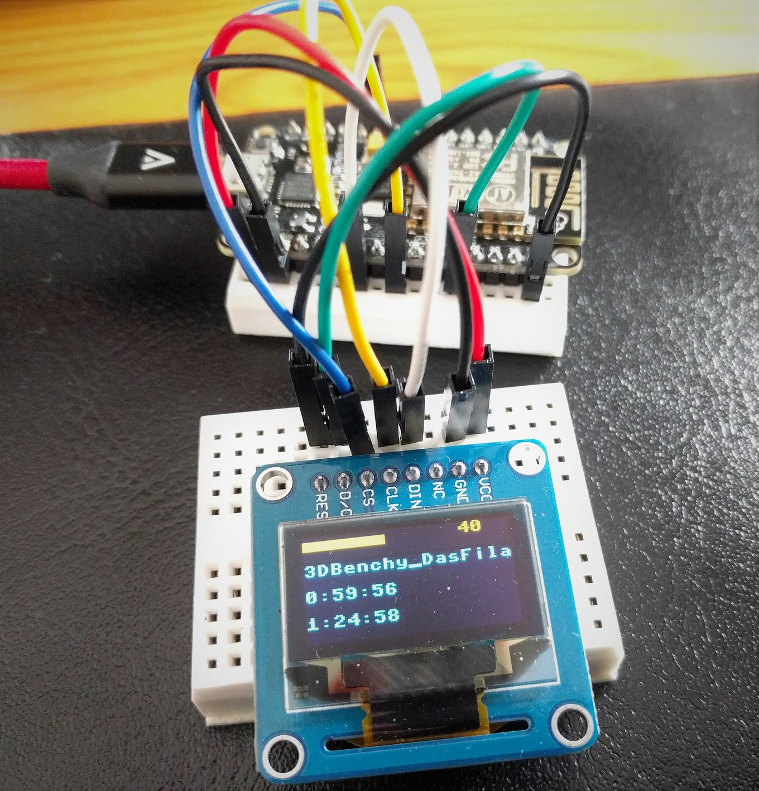

# OctoOled
Display information about the current OctoPrint print job on a SSD1306 OLED display via the OctoPrint REST API

## Hardware
You will need an ESP8266 microcontroller and a SSD1306 OLED display. The code is written for SPI, but can be easily adapted to use I2C.

## Software
1. Set up Micropython on your ESP8266 controller: [Getting started with MicroPython](https://docs.micropython.org/en/latest/esp8266/esp8266/tutorial/intro.html)
1. Install ampy on your machine with `pip install adafruit-ampy`. Information about this tool can be found [here](https://github.com/adafruit/ampy)
1. Configure the network connection: [Configuration of the WiFi](https://docs.micropython.org/en/latest/esp8266/esp8266/tutorial/network_basics.html#configuration-of-the-wifi). To do that you can copy the `sample_boot.py` file and rename it to `boot.py`. Enter your Wifi credentials in the file and upload it via ampy: `ampy --port YOUR_PORT_HERE put boot.py`
1. Copy `sample_config.py` and rename it to `config.py`. Edit the file and enter the correct pin mapping, OctoPrint IP address and API key. Explanation on how to obtain an API key: [REST API Authorization](http://docs.octoprint.org/en/master/api/general.html#authorization)
1. Finally upload `octo_oled.py` and `config.py`:
    * `ampy --port YOUR_PORT_HERE put config.py`
    * `ampy --port YOUR_PORT_HERE put octo_oled.py ./main.py`
    
You should be all set! After powering up, the SSD1306 OLED display should show you information about your currently running print job.

## ToDo
- [x] Display name of the current print job, elapsed time, remaining time and percentage on the display
- [ ] 3D printable case for the microcontroller and the OLED display
- [ ] Show message if no print job is running
- [ ] Beautify the display output
